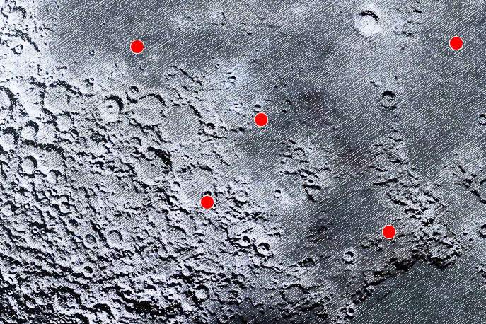
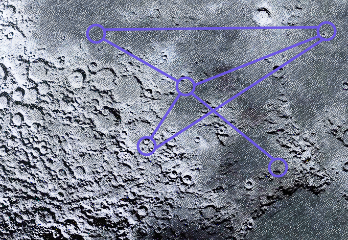

# Chaand Chhupa Baadal Mein

Once upon a time, there was a little aspiring girl name *Chandini*. She was curious about space exploration, but at the same time she was lazy and procrastinated tasks. One fine evening she was sitting with her grandpa while gazing stars and the moon. During conversation, grandpa criticized her delaying attitude. He then said:
> **चलो तो चाँद तक वरना शाम तक ।**

An ancient Indian proverb meaning: 
> **Go all the way, finish that or don't even try.**

Inspired by his works and passionate hard work, 20 years past she literally became an ISRO astronaut. She is now a commander of a human space exploration programme. On her voyage to moon, suddenly some sensors and instruments got destroyed due to hitting by space debris. She has to land the spacecraft with 10 over passengers and researchers.
Due to sensor failure, she has to manually decide how the ship lands on the moon surface where points are already being marked.  

  

All these points can be considered as nodes of an undirected graph. With given Chromatic Number(**C**), define if the graph is **C**-Colorable Graph.  

  

Help *Chandini* to safely land all the ships on graph nodes, by coloring nodes with minimum available colors.
___
## Input
For multiple test case **T**, program will be run separately.
- No. of Vertices (**V**)
- No. of Colors Available (**C**)
- Total No. of Edges (**E**)
- **E** pairs of space separated integers denoting the edges between vertices 
___
## Output
- **TRUE**, if solution is feasible. Otherwise **FALSE**.
___
## Constraints
- 1 ≤ **T** ≤30
- 1 ≤ **V** ≤50
- 1 ≤ **C** ≤ **V**
- 1 ≤ **E** ≤ **V**∗(**V**−1)
___
## Testing
|S.r. No.|Sample Input|Sample Output|
|:-|:-|:-:|
|#0|1 4 3 5 1 2 2 3 3 4 4 1 1 3| TRUE |
|#1|1 4 3 14 2 4 3 4 2 1 3 2 3 4 1 3 1 3 4 1 4 1 3 2 2 4 2 3 2 4 4 1|FALSE|
___
## EXPLANATION
- **C**-Colorable: If the graph can be colored with at most **C** colors such that no two adjacent vertices of the graph are colored with the same color or every edge is adjacent to two different colors. i.e 𝛘(**G**) ≤ **C**
- Chromatic Number or 𝛘(**G**): Smallest number (**C**) of colors needed to color a graph **G** and and is **C**-Colorable.
___
## HINT
Here coloring of a graph means assignment of colors to all vertices. Vertex are 1-based (vertext number starts with 1, not 0).

 

